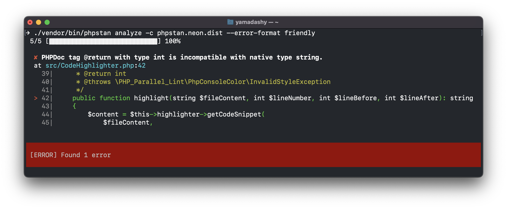

<div align="center">
  <h1>PHPStan Formatter Friendly</h1>
  A simple error formatter for PHPStan that display code frame.
</div>
<p align="center">
    
</p>
<p align="center">
  <a href="https://github.com/yamadashy/phpstan-formatter-friendly/actions"></a>
  <a href="https://packagist.org/packages/yamadashy/phpstan-formatter-friendly"></a>
  <a href="https://github.com/yamadashy/phpstan-formatter-friendly/blob/master/LICENSE.md"></a>
</p>

---

# Getting Started

1. You may use [Composer](https://getcomposer.org/) to install this package as a development dependency.
```shell
composer require --dev yamadashy/phpstan-formatter-friendly
```

2. Register error formatter into your `phpstan.neon` or `phpstan.neon.dist`:
```neon
includes:
    - ./vendor/yamadashy/phpstan-formatter-friendly/extension.neon
```

3. Finaly, use phpstan console command with `--error-format` option:
```shell
./vendor/bin/phpstan analyze --error-format friendly
```

## Optional
If you want to make it simpler, setting `scripts` in `composer.json` as follows:

```json
{
    "scripts": {
        "analyze": "phpstan analyze --error-format friendly"
    }
}
```

You can run a short command like this:
```shell
composer analyze
```


# Config
You can customize in your `phpstan.neon`:
```neon
parameters:
    friendly:
        # default is 3
        lineBefore: 3
        lineAfter: 3
```

- `lineBefore` ... Number of lines to display before error line
- `lineAfter` ... Number of lines to display after error line

